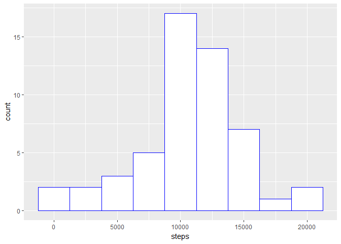
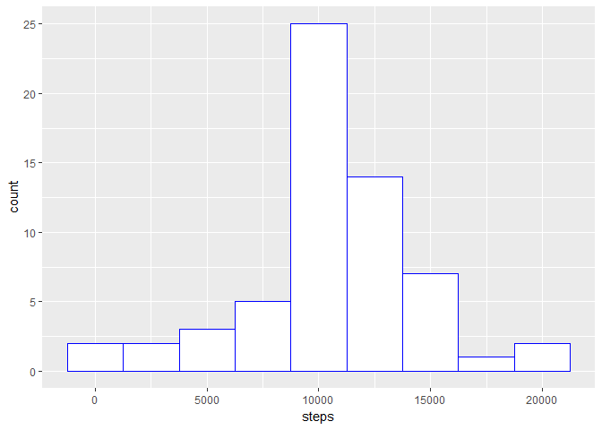
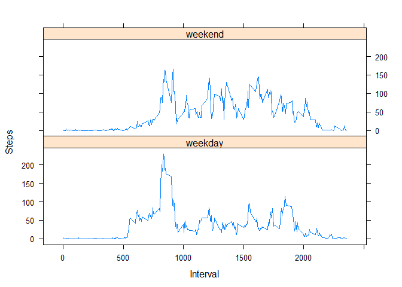

# Reproducible Research: Peer Assessment 1


## Loading and preprocessing the data


```r
library(chron)
library(dplyr)
library(ggplot2)
library(lattice)
library(data.table)
```
## Read in the Data


```r
activity <- read.csv("./data/activity.csv")
str(activity)
```

```
## 'data.frame':	17568 obs. of  3 variables:
##  $ steps   : int  NA NA NA NA NA NA NA NA NA NA ...
##  $ date    : Factor w/ 61 levels "2012-10-01","2012-10-02",..: 1 1 1 1 1 1 1 1 1 1 ...
##  $ interval: int  0 5 10 15 20 25 30 35 40 45 ...
```

After reading in the data,the structure of the data is checked. The data consist of 17,658 observations and 3 varaiables: steps; date; and Interval. "steps"" refers to the number of steps walked by the subject in each 5 minute interval, and "interval" refers to the 5 minute interval across the day. "date" is the date the measurement was taken. steps and interval are integer data types. By default, date was read in by R as a factor field with 61 levels.This is okay for now. It also confirms that the data is across a period of two months(61 days).

Next a quick summary of the data is conducted.


```r
summary(activity)
```

```
##      steps                date          interval     
##  Min.   :  0.00   2012-10-01:  288   Min.   :   0.0  
##  1st Qu.:  0.00   2012-10-02:  288   1st Qu.: 588.8  
##  Median :  0.00   2012-10-03:  288   Median :1177.5  
##  Mean   : 37.38   2012-10-04:  288   Mean   :1177.5  
##  3rd Qu.: 12.00   2012-10-05:  288   3rd Qu.:1766.2  
##  Max.   :806.00   2012-10-06:  288   Max.   :2355.0  
##  NA's   :2304     (Other)   :15840
```
The mean number of steps walked in each interval is 37 steps, and there are 2304 missing values.

No data transformations are done at this stage. The necessary transformations are carried out in each section of the analysis below. Each section addresses a specific question.

## What is mean total number of steps taken per day?

For this question, missing values are ignored. the data are first restricted to those observations with complete values of steps.

```r
clean_activity <- activity[is.na(activity$steps)=="FALSE",]

clean_activity <- as.data.table(clean_activity)
dim(clean_activity)
```

```
## [1] 15264     3
```
The resulting data now have 15,264 observations after removing the 2,304 observations with missing values for steps.

#### Make a histogram of the total number of steps taken each day

Next, the data are grouped by date, which has been deliberately left as factor variable. The total number of steps for each day is then computed and plotted on a histogram.


```r
totalSteps_perDay <- clean_activity %>%
                group_by(date) %>%
                  summarise(steps_sum = sum(steps))
names(totalSteps_perDay) <- c("date","steps")

ggplot(data = totalSteps_perDay)+
  geom_histogram(binwidth = 2500,aes(x=steps),fill = "white",colour = "Blue")
```

<!-- -->

#### Calculate and report the mean and median total number of steps taken per day


```r
meanSteps_perDay <- round(mean(totalSteps_perDay$steps),0)
meanSteps_perDay
```

```
## [1] 10766
```

```r
medianSteps_perDay <- median(totalSteps_perDay$steps)
medianSteps_perDay
```

```
## [1] 10765
```

The mean and median total number of steps per day are 10,766 and 10,765 respectively.

## What is the average daily activity pattern?

Again, for this part of the report missing values of steps are ignored by using the same subset of the data used in question 1 which excludes these missing values.

#### Make a time series plot (i.e. type = "l") of the 5-minute interval (x-axis) and the average number of steps taken, averaged across all days (y-axis)


```r
averageSteps_perInterval <- clean_activity[,mean(steps),by = "interval"]

names(averageSteps_perInterval) <- c("interval","steps")

averageSteps_perInterval$interval <- as.numeric(averageSteps_perInterval$interval)

xyplot(steps~interval,data=averageSteps_perInterval,type="l")
```

<!-- -->

#### Which 5-minute interval, on average across all the days in the dataset, contains the maximum number of steps?


```r
averageSteps_perInterval[which.max(averageSteps_perInterval$steps),]$interval
```

```
## [1] 835
```

On average, the most steps are taken in interval 835 during which approximatley 200 steps are walked.

## Imputing missing values
As noted earlier, there are 2,304 observations in the original data with missing values. Thus far, these have simply been excluded from the calculations. However, this may introduce some bias into the calculations.

#### Calculate and report the total number of missing values in the dataset (i.e. the total number of rows with NAs)

The code chunk below confirms the number of missing observations in the original data set as 2,304.


```r
missing <- sum(is.na(activity$steps))
               missing
```

```
## [1] 2304
```

#### Devise a strategy for filling in all of the missing values in the dataset. The strategy does not need to be sophisticated. For example, you could use the mean/median for that day, or the mean for that 5-minute interval, etc.

The strategy chosen for filling in the missing values is to plug them with the mean number of steps for the corresponding time interval with missing values excluded.

#### Create a new dataset that is equal to the original dataset but with the missing data filled in.

In the code chunk below, the mean number of steps for each interval is computed. The code then loops through the original data set replacing missing steps values with the corresponding interval mean. It then checks that there are longer missing values in the data and that the number of replacements made is 2,304 as expected.

After that, a new data set of equal dimensions to the original data set is created.


```r
#create a data frame with means for each average
               
meanOfInterval <- clean_activity[,mean(steps),by = "interval"]

names(meanOfInterval) <- c("interval","average")

#merge that to the original data set by interval

activity_1 <- merge(activity,meanOfInterval,by.x = "interval",by.y="interval")

#loop through the dataframe replacing the NAs with the rounded average for that interavl

for (obs in 1:nrow(activity_1)){
  
if(is.na(activity_1$steps[obs])){
  activity_1$steps[obs] <- round(activity_1$average[obs],0)
   activity_1$replacement[obs] <- 1
}else{
  activity_1$steps[obs] <- activity_1$steps[obs]
  activity_1$replacement[obs] <- 0
}

}
  
#check that replacement has worked
sum(is.na(activity_1$steps))
```

```
## [1] 0
```

```r
sum(activity_1$replacement)
```

```
## [1] 2304
```

```r
#Now create a final new dataframe
activityNew <- activity_1[,1:3]
```

#### Make a histogram of the total number of steps taken each day and Calculate and report the mean and median total number of steps taken per day. Do these values differ from the estimates from the first part of the assignment? What is the impact of imputing missing data on the estimates of the total daily number of steps?


```r
newSteps_perDay <- activityNew %>%
        group_by(date) %>%
          summarise(new_sum = sum(steps))

names(newSteps_perDay) <- c("date","steps")


ggplot(data = newSteps_perDay)+
  geom_histogram(binwidth = 2500,aes(x=steps),fill = "white",colour = "Blue")
```

<!-- -->
The shape of the distribution remains fairly similar. However, there are now more observations as expected and the frequency of the number of steps around the median has increased from ~ 16 to 25.


```r
newMeanSteps_perDay <- round(mean(newSteps_perDay$steps),0)
newMeanSteps_perDay
```

```
## [1] 10766
```

```r
newMedianSteps_perDay <- median(newSteps_perDay$steps)
newMedianSteps_perDay
```

```
## [1] 10762
```
The revised mean number of steps per day remains the same as the original at 10,766. However, the revised median is slightly lower at 10,762 compared to the original value of 10,765.


## Are there differences in activity patterns between weekdays and weekends?

#### Create a new factor variable in the dataset with two levels -- "weekday" and "weekend" indicating whether a given date is a weekday or weekend day.

For this part, it is neccesarry to convert the date variable to date format so as to derive the day of the week and subsequently the two level factor variable.


```r
activityNew$date <-  as.Date(activityNew$date)
activityNew$weekDay <- weekdays(activityNew$date)

activityNew$WeekLevel <- factor(ifelse(activityNew$weekDay %in% c("Saturday","Sunday"),"weekend","weekday"))

activityNew <- as.data.table(activityNew)

summaries <- activityNew %>%
          group_by(WeekLevel,interval) %>%
            summarise(stepsMeans = mean(steps,na.rm =T))
```

#### Make a panel plot containing a time series plot (i.e. type = "l") of the 5-minute interval (x-axis) and the average number of steps taken, averaged across all weekday days or weekend days (y-axis).


```r
summaries$interval <- as.numeric(summaries$interval)

xyplot(stepsMeans ~ interval | WeekLevel, summaries, type = "l", layout = c(1, 2), 
   xlab = "Interval", ylab = "Steps")
```

<!-- -->

There are differences in activity pattern between weekends and weekdays. During weekends, activity starts at a slightly later time and the number of steps at the start of day is smaller compared to weekdays. Although the peakk times are almost similar, the peak number of steps is lower during weekends, ~ 150 compared to ~240. However, during weekends the number of steps walked throughout the day is closer to the peakk, whilst during weekdays there is a big drop after the peak. This is plausible as during weekday the subject probably wakes up earlier and walks more in preperation and perhaps travelling to their place of work before settling into their work routine which limits their opportunity to walk. On the other hand, during weekends their day starts later and walking pattern is more uniform across the time intervals of the day.
